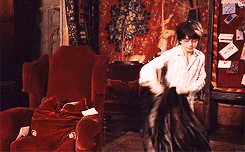

# Cloak_of_Invisibility
Harry Potter's "Cloak of Invisibility" using OpenCV


The <strong>Cloak of Invisibility</strong> is a magical artefact used to render the wearer invisible, and one of the fabled Deathly Hallows.
In <i><strong>"The Tale of the Three Brothers"</strong></i>, it was the third and final Hallow created, supposedly by Death himself, and bestowed upon Ignotus Peverell after he requested, as his bounty, for something with the power to hide him if he were to go place to place without being followed by Death.
According to legend, whoever united it with the other two Hallows (the Elder Wand and the Resurrection Stone) would become the Master of Death.

With the help of OpenCV, here is the <strong>"Cloak of Invisibility"</strong> like Harry Potter had which he got from Dumbledore at Hogwarts.

### Working
This technique is opposite to the Green Screening. In green screening, we remove background but here we will remove the foreground frame.<br>
1. Capture and store the background frame.<br>
2. Detect the red colored cloth using color detection algorithm.<br>
3. Segment out the red colored cloth by generating a mask.<br>
4. Generate the final augmented output to create the magical effect.<br>

# Implementation
## Importing Libraries
<strong>OpenCV</strong> will be used for image processing part i.e. to start the camera, read each frame in code, color detection, color masking, and streaming final results<br>
<strong>Numpy</strong> will be used to deal with arrays as images in python are a series of Numpy array<br>
<strong>Time </strong><br>

```
import cv2
import time
import numpy as np
```

```
# Preparation for writing the ouput video
fourcc = cv2.VideoWriter_fourcc(*'XVID')
out = cv2.VideoWriter('output.avi', fourcc, 20.0, (640, 480))
```

## HSV - Hue Saturation Value
<strong>H : Hue</strong><br>
Hue is the colour portion of the model, expressed as a number from 0 to 360 degrees:<br>
Red falls between 0 and 60 degrees.<br>
Yellow falls between 61 and 120 degrees.<br>
Green falls between 121–180 degrees.<br>
Cyan falls between 181–240 degrees.<br>
Blue falls between 241–300 degrees.<br>
Magenta falls between 301–360 degrees.<br>

<strong>S : Saturation</strong><br>
Saturation describes the amount of grey in a particular colour, from 0 to 100 percent.<br>
Reducing this component toward zero introduces more grey and produces a faded effect. Sometimes, saturation appears as a range from just 0–1, where 0 is grey, and 1 is a primary colour.

<strong>V : Value</strong><br>
Value works in conjunction with saturation and describes the brightness or intensity of the colour, from 0–100 percent, where 0 is completely black, and 100 is the brightest and reveals the most colour.

### Recording and caching the background for each frame.
We are replacing the red colored pixels with the background pixels to create the invisible effect in the video. 
For doing this, we have to store the background image for each frame.

```
# Reading from the webcam
cap = cv2.VideoCapture(0)

# Allow the system to sleep for 3 seconds before the webcam starts
time.sleep(3)
count = 0
background = 0

# Capture the background in range of 60
for i in range(60):
    ret, background = cap.read()
background = np.flip(background, axis=1)
```

### Detecting the define color portion In each frame
In this step, we will put our focus on detecting the red part in the image. 
We will convert the RGB (red-blue-green) to HSV(hue-saturation-value) because RGB values are highly sensitive to illumination. 
After the conversion of RGB to HSV, it is time to specify the range of color to detect red color in the video. Below color values are for red color

```
# Read every frame from the webcam, until the camera is open
while cap.isOpened():
    ret, img = cap.read()
    if not ret:
        break
    count += 1
    img = np.flip(img, axis=1)
    # Convert the color space from BGR to HSV
    hsv = cv2.cvtColor(img, cv2.COLOR_BGR2HSV)

    # Generate masks to detect red color
    lower_red = np.array([0, 125, 50])
    upper_red = np.array([10, 255, 255])
    mask1 = cv2.inRange(hsv, lower_red, upper_red)
    lower_red = np.array([170, 120, 70])
    upper_red = np.array([180, 255, 255])
    mask2 = cv2.inRange(hsv, lower_red, upper_red)
    mask1 = mask1 + mask2
```

### Replacing the red portion with a mask image in each frame
Now, we have a red part of the video in the 'mask' image, we will segment the mask part from the frames. 
We will do a morphology open and dilation for that.

```
    # Open and Dilate the mask image
    mask1 = cv2.morphologyEx(mask1, cv2.MORPH_OPEN, np.ones((3, 3), np.uint8))
    mask1 = cv2.morphologyEx(mask1, cv2.MORPH_DILATE, np.ones((3, 3), np.uint8))

    # Create an inverted mask to segment out the red color from the frame
    mask2 = cv2.bitwise_not(mask1)

    # Segment the red color part out of the frame using bitwise and with the inverted mask
    res1 = cv2.bitwise_and(img, img, mask=mask2)

    # Create image showing static background frame pixels only for the masked region
    res2 = cv2.bitwise_and(background, background, mask=mask1)
```

### Generating the final output and writing
We replace the pixel values of the detected red color region with corresponding pixel values of the static background and finally generate an augmented output which creates the magical effect, converting our cloth into an invisibility cloak. 
To do this we use bitwise_and operation first to create an image with pixel values, corresponding to the detected region, equal to the pixel values of the static background and then add the output to the image (res1) from which we had segmented out the red cloth.
If 'q' is pressed from keyboard, the window will close and the output will be saved in output file.

```
# Generating the final output and writing
    finalOutput = cv2.addWeighted(res1, 1, res2, 1, 0)
    out.write(finalOutput)
    cv2.imshow("Harry Potter's Cloak of Invisibility", finalOutput)
    # cv2.waitKey(1)
    key = cv2.waitKey(1) 
    if key == ord('q'):
        print('You are visible now.')
        break
    

cap.release()
out.release()
cv2.destroyAllWindows()
```

## That’s Harry Potter trying out his invisibility cloak!

